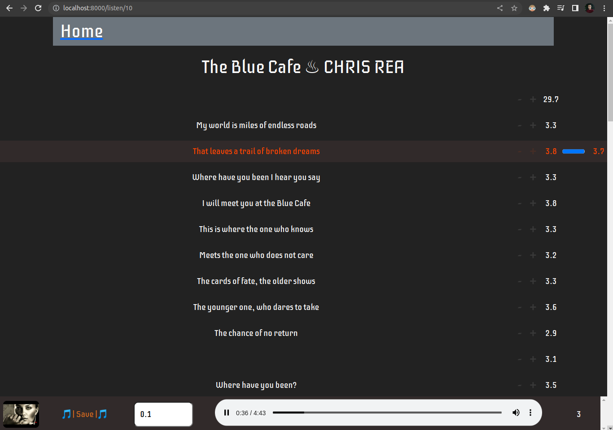
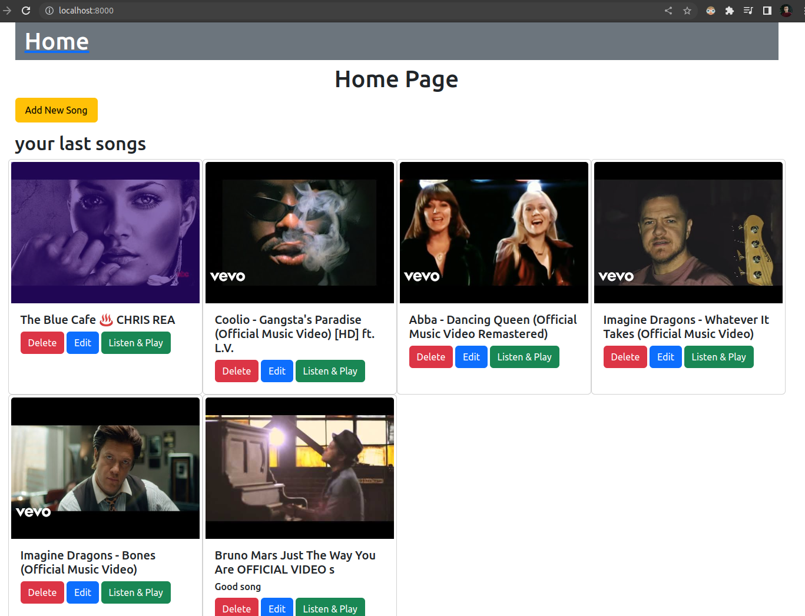

# Learn with music - hobby project that allows to download music and play & learn with its lyrics.

This project is in a starting phase, I may decide to add features and fix things in my free time later.

# Installation

make sure you have docker, docker-compose and make installed, then run

```bash
make up
```

After few minutes go to localhost:8000/ to view current UI, where you can add new songs and listen to them.

These are useful shortcuts for listen page:  
. s - to save current timing of song  
. p - to play/pause  
. 0/1/5 - to change number that controls how many seconds should 1 click make difference in timings  
. l(el) - to turn on/off auto scroll when playing

Example image of current listen page  


And some songs added (currently even pagination is not implemented)  


Youtube video used [The Blue Cafe ♨︎ CHRIS REA](https://www.youtube.com/watch?v=M7yFx8PqwLI&ab_channel=setzehomes)

## Lots of useful features can be implemented, but for now, just these are implemented as an MVP

. Download of video using given Youtube url (other sources support may be added later)  
. Download of subtitles using given Youtube video url (other sources support may be added later)  
. Add subtitles manually and/or edit timing for existing ones so that music is in sync with each line
. Listen to downloaded audio and see the subtitles using timing that we set in previous steps

# some important todos

. make code cleaner when it becomes clear that specific features will remain this way for now  
. add pydantic models/dataclasses for important functionality, ex: use something like LyricsLine object with all required fields to pass between functions, instead of doing validations by hand and relying on passer functions. This will allow for example to create same LyricsLine object by supplying start time and duration, or start time and end times, so that we do not need to care about those details later on, we will always have data we need.
. Fix and add more tests

# ATTENTION

You do not need to be copyright expert to know that there are lots of laws and restrictions about usage of digital content of someone else, this project does not intend or promote to do this as it is using publicly available sites and libraries to do what it does and does not use it for commercial purposes.

# testing

More tests should be added later, you can run current ones by

```bash
make test
```
